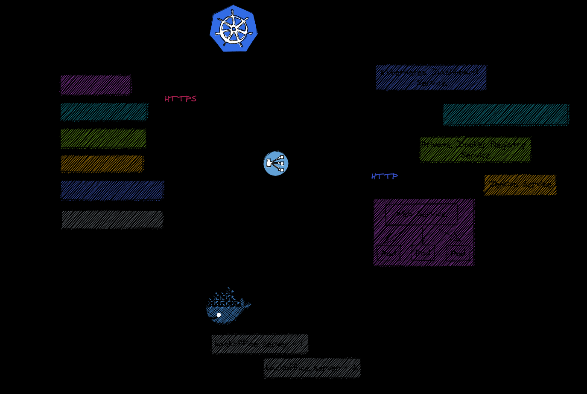

Traefik Helm Deployment

This Deployment uses the official Helm Chart from traefik.io https://github.com/traefik/traefik-helm-chart.

These are templates to modify the deployment.

[Avec prometheus](https://traefik.io/blog/capture-traefik-metrics-for-apps-on-kubernetes-with-prometheus/)
[CRD Schema](https://doc.traefik.io/traefik/routing/providers/kubernetes-crd/)